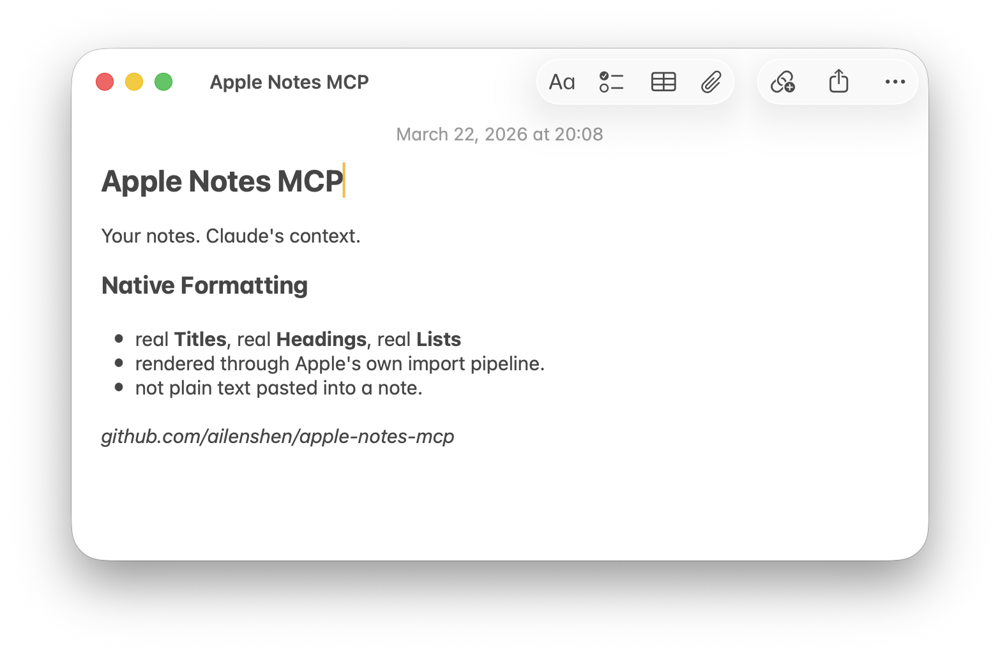

# Apple Notes MCP Server

Bidirectional conversion between Apple Notes native format and Markdown — read notes as Markdown, write Markdown that becomes natively formatted notes.

I built this because I want Apple Notes to be my personal data hub, and I need it to work seamlessly with AI. This MCP server is the bridge.

<picture>
  <source media="(prefers-color-scheme: dark)" srcset="assets/screenshot-dark.png">
  <source media="(prefers-color-scheme: light)" srcset="assets/screenshot-light.png">
  
</picture>

**Requirements:** macOS 26 (Tahoe) or later.

## Why This One?

There are other Apple Notes MCP implementations (including Claude's built-in one). Here's what makes this one different:

**Bidirectional native format ↔ Markdown conversion.** Other implementations lose formatting — they read plain text or write plain text into note bodies. This one preserves it in both directions:

- **Reading:** Apple Notes HTML → Markdown via [turndown](https://github.com/mixmark-io/turndown). Headings, bold, italic, lists, code — all faithfully converted.
- **Writing:** Markdown → native Apple Notes formatting via macOS's built-in Markdown import. Titles become real Titles, headings become real Headings, not plain text.

The trade-off: Notes.app will briefly appear during note creation (~3 seconds), because we use `open -a Notes` to trigger the native import pipeline. It's the only way to get true native formatting without reverse-engineering Apple's private internal format.

**Fast reads via SQLite.** Listing and searching notes queries the NoteStore database directly — under 100ms, no AppleScript overhead.

## What Can It Do?

- **List notes** — browse all your notes or filter by folder
- **Search notes** — find notes by keyword
- **Read a note** — get the full content of any note (returned as Markdown)
- **Create a note** — write a new note from Markdown (with native formatting)
- **Update a note** — replace a note's content while preserving its folder
- **Delete a note** — move a note to Recently Deleted

## Setup

### Prerequisites

- [Node.js](https://nodejs.org/) 24+ (LTS)
- macOS permissions for **`node`** (not Terminal or Claude Desktop):
  1. **Full Disk Access** — System Settings → Privacy & Security → Full Disk Access → add `node`
  2. **Accessibility** — System Settings → Privacy & Security → Accessibility → add `node`

To find your `node` path: `which node` (typically `/usr/local/bin/node` or `/opt/homebrew/bin/node`).

### Option A: Local (stdio)

For Claude Desktop or Claude Code on the same Mac. Add to your MCP client config:

```json
{
  "mcpServers": {
    "apple-notes": {
      "command": "npx",
      "args": ["-y", "@ailenshen/apple-notes-mcp@latest"]
    }
  }
}
```

For Claude Desktop, the config file is at `~/Library/Application Support/Claude/claude_desktop_config.json`.

### Option B: Remote (HTTP)

For accessing your Apple Notes from anywhere — Claude on your phone, another computer, or any MCP client that supports HTTP.

Start the server in HTTP mode on your Mac:

```bash
npx @ailenshen/apple-notes-mcp@latest --http
```

This will print an endpoint URL with a random secret path:

```
Apple Notes MCP server running on HTTP
Endpoint: http://localhost:3100/mcp/a3f8b2c9e1d4...
```

The secret in the URL is the only authentication — anyone with the full URL can access your notes.

**Making it accessible remotely:** The HTTP server listens on `0.0.0.0:3100` by default. To access it over the internet, put it behind HTTPS using any reverse proxy or tunnel you prefer (ngrok, Cloudflare Tunnel, a VPS with nginx, etc.), then point your remote MCP client to the HTTPS URL.

**CLI options:**

| Flag | Default | Description |
|------|---------|-------------|
| `--http` | off | Enable HTTP mode (default is stdio) |
| `--port <number>` | 3100 | HTTP port |
| `--secret <string>` | random | Custom URL secret (auto-generated if omitted) |

**Running as a persistent service on macOS:** To keep the server running across reboots with a fixed secret, create a LaunchAgent. See the [wiki](https://github.com/ailenshen/apple-notes-mcp/wiki) for an example plist.

## Usage Examples

Once configured, just talk to Claude naturally:

- "List all my notes in the Projects folder"
- "Search my notes for 'meeting agenda'"
- "Read my note titled 'Shopping List'"
- "Create a note in my Work folder with today's action items"
- "Update my 'Shopping List' note with these new items"
- "Delete the note called 'Old Draft'"

## How It Works

| Action | Method | Speed |
|--------|--------|-------|
| List / Search | SQLite (read-only) | < 100ms |
| Read | AppleScript → Markdown | ~1s |
| Create | Native Markdown import | ~3-4s |
| Update | Delete + Create | ~4-5s |
| Delete | AppleScript | ~1s |

- **Reading** is done through a read-only SQLite connection to the Notes database — fast and safe. Note content is converted from HTML to Markdown via [turndown](https://github.com/mixmark-io/turndown).
- **Creating** uses macOS's native Markdown import (`open -a Notes`), so formatting is preserved natively.
- **Updating** deletes the old note and creates a new one, automatically preserving the original folder.
- **Deleting** moves notes to Recently Deleted, just like doing it manually.

## Markdown Support

When creating notes, most Markdown works natively:

| Element | Support |
|---------|---------|
| Headings, **bold**, *italic*, lists, `inline code` | Fully supported |
| Block quotes | Content preserved, no indent style |
| Links | Text preserved, URL lost |
| Tables, footnotes | Not supported |

## Roadmap

- [x] **Publish to npm** — `npx @ailenshen/apple-notes-mcp` just works, zero setup beyond the config file.
- [x] **Remote connection (Streamable HTTP)** — Access your Apple Notes from anywhere via HTTP. Your Mac becomes the bridge between any remote MCP client and your notes.
- [x] **Update note** — delete + recreate with folder preservation.

## Vision

Apple Notes is the most natural place to keep personal knowledge on Apple devices — it syncs everywhere, it's fast, and it's private. But it's a walled garden with no API.

This project makes Apple Notes a first-class data source for AI. The long-term goal: wherever you're talking to Claude — on your Mac, on your phone, on the web — your Apple Notes are always accessible, readable, and writable.

## License

MIT

[](https://glama.ai/mcp/servers/ailenshen/apple-notes-mcp)